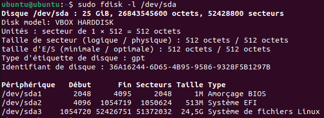
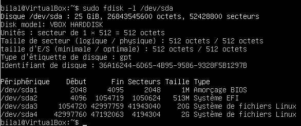
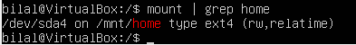
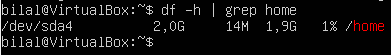

# Création d'une nouvelle partition pour le répertoire `/home`

Ce projet est une mise en pratique des concepts appris dans le livre _"Ubuntu - Administration d'un système Linux"_ des éditions ENI, spécifiquement sur la gestion des disques et systèmes de fichiers. L'objectif de cet exercice est de créer une nouvelle partition à partir de celle contenant le système de fichiers Linux et de déplacer le répertoire `/home` vers cette nouvelle partition.

## Contexte

La configuration par défaut d'Ubuntu installe tout le système de fichiers sur une seule partition. L'objectif ici est de :

1. Redimensionner la partition actuelle du système de fichiers pour libérer de l'espace.
2. Créer une nouvelle partition dédiée pour le répertoire `/home`.
3. Déplacer le contenu de `/home` vers cette nouvelle partition et rendre le montage permanent.

## Étapes détaillées

### Prérequis

Avant de manipuler les partitions, il est essentiel de faire un clone de la machine virtuelle (VM) ou une sauvegarde complète des données. Toute mauvaise manipulation pourrait entraîner la perte de données.

### Étape 1 : Redimensionner la partition contenant le système de fichiers

Le système de fichiers est de type `ext4`, donc il doit être redimensionné à froid, c'est-à-dire hors ligne. Pour cela, utilisez une session Live CD d'Ubuntu. Voici les commandes utilisées :

1. Afficher le partitionnement actuel :

   ```bash
   sudo fdisk -l /dev/sda
   ```


   *(Dans cet exemple, la partition à redimensionner est `/dev/sda3`)*

2. Vérifier et corriger les erreurs éventuelles du système de fichiers :

   ```bash
   sudo e2fsck -fyvC 0 /dev/sda3
   ```

3. Redimensionner le système de fichiers (ici, on libère 4,5 Go, en passant de 24,5 Go à 20 Go) :

   ```bash
   sudo resize2fs -p /dev/sda3 20971520K
   ```

4. Modifier la partition avec `fdisk` :

   ```bash
   sudo fdisk /dev/sda
   ```

   - Supprimer la partition actuelle (`/dev/sda3`) :
     ```
     d
     3
     ```

   - Créer une nouvelle partition avec la taille souhaitée (20 Go) :
     ```
     n
     3
     (Appuyer sur "Entrée" pour accepter les valeurs par défaut)
     +20G
     n
     ```

   Ne pas supprimer la signature de l'ancienne partition est ce qui va permettre de récupérer toutes les données.

   - Enregistrer les modifications et quitter :
     ```
     w
     ```

   Nous avons ainsi réduit la partition à 20 Go, libérant 4,5 Go d'espace non alloué.

### Étape 2 : Créer une nouvelle partition pour le répertoire `/home`

1. Créer une nouvelle partition de 2 Go pour `/home` :

   ```bash
   sudo fdisk /dev/sda
   ```

   - Créer une nouvelle partition :
    ```
     n
     (Appuyer sur "Entrée" pour accepter les valeurs par défaut)
     +2G
     ```

   - Enregistrer les modifications et quitter :
     ```
     w
     ```

2. Une fois la nouvelle partition créée, vous pouvez redémarrer le système pour revenir à votre installation normale (version de base). Assurez vous d'enlever le CD de la version Live afin que votre machine démarre directement sur le disque dur :

   ```bash
   reboot
   ```

3. Une fois de retour sur votre installation principale, formatez la nouvelle partition en `ext4` :

   ```bash
   sudo mkfs -t ext4 -m 0 -L "/home" /dev/sda4
   ```

   Cette commande crée un système de fichiers `ext4` sur la nouvelle partition avec l'étiquette (label) `/home`. 


   
La partition est maintenant prête à accueillir le répertoire `/home` !

### Étape 3 : Déplacer le répertoire `/home` vers la nouvelle partition

1. Monter la nouvelle partition temporairement :

   ```bash
   sudo mkdir /mnt/home
   sudo mount -t ext4 /dev/sda4 /mnt/home
   ```

2. Vérifier que le montage a été réalisé correctement :

   ```bash
   mount | grep home
   ```



3. Copier le contenu de l'ancien répertoire `/home` vers la nouvelle partition tout en conservant les permissions :

   ```bash
   sudo cp -a /home/* /mnt/home
   ```

4. Sauvegarder l'ancien répertoire `/home` par précaution :

   ```bash
   sudo mkdir /backup_old_home
   sudo mv /home/* /backup_old_home
   ```

5. Démonter la nouvelle partition :

   ```bash
   sudo umount /mnt/home
   ```

6. Modifier le fichier `/etc/fstab` pour que la nouvelle partition soit montée automatiquement au démarrage :

   ```bash
   sudo vi /etc/fstab
   ```

   Ajouter la ligne suivante à la fin du fichier :

   ```
   LABEL=/home /home ext4 defaults 0 2
   ```

7. Monter la nouvelle partition `/home` :

   ```bash
   sudo mount LABEL=/home
   ```

### Étape 4 : Redémarrer et vérifier

Enfin, redémarrer la machine et vérifier que le répertoire `/home` est correctement monté sur la nouvelle partition :

```bash
reboot
```

Après le redémarrage, vous pouvez vérifier que tout est en ordre avec la commande :

```bash
df -h | grep home
```



---

## Conclusion

Ce processus permet de déplacer le répertoire `/home` vers une partition dédiée, offrant une meilleure gestion du système de fichiers et facilitant la gestion des sauvegardes et des mises à jour. Cela peut également améliorer la performance et la sécurité des données personnelles stockées dans le répertoire `/home`.
